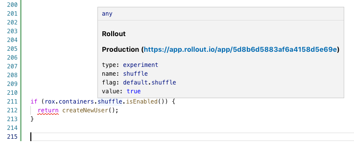

# Rollout.io VS Code extension

This extension provides data about your Rollout.io's experiments from within VS Code.

Hover with the mouse on either your flag name or the isEnabled/getValue function to see the experiment data.
You can also hover the definition of the flag (`{ someFlag: new Rox.Flag() }`)

Currently only javascript and typescript are supported.

## Requirements

1. An active Rollout.io account
2. Obtain API Token from the dashboard (under App Settings -> Integrations)

## Installation
1. Install the extension
2. Update the `conf.rollout.apiToken` with your API Token

## Extension Settings

* `conf.rollout.apiToken`: API Token from the dashboard
* `conf.rollout.appId`: App Id - Limit the data to this app only 
* `conf.rollout.environmentName`: Environment Name - Limit the data to this environment only
* `conf.rollout.useLineForHover`: Hover anywhere in a line which contains a flag to see the experiment data

## Release Notes

### 0.3.0

Handle errors while fetching data

### 0.2.1

Add hover to containers as well

### 0.0.1

Initial release of Rollout VS Code extension
